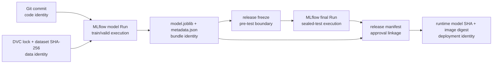

# 2장 강사용 모델 계보 가이드

이 문서는 강사가 `DVC → MLflow Run → 모델 묶음 → release manifest`를 직접
실행하고, 화면과 코드를 오가며 설명하기 위한 진행안입니다. 수강생에게 새 공식
모델을 만들게 하는 절차가 아니라, 준비된 V2 evidence와 새 학생 개발 Run을
구분해 읽는 수업입니다.

## 1. 강의 목표와 한 문장 설명

강의가 끝나면 다음 문장을 설명할 수 있어야 합니다.

> Git은 코드 상태, DVC와 데이터 SHA-256은 데이터 재현 상태, MLflow Run은 한
> 번의 실행, 모델 묶음은 실행 파일, release manifest는 검증된 식별값과 승인
> 결정을 연결한다.

어느 한 ID도 다른 ID를 대신하지 않습니다. 같은 profile 이름을 사용하더라도
Run, 파일, 데이터와 배포는 각각 자기 식별값으로 확인합니다.



## 2. 용어 기준

| 용어 | 무엇을 식별하는가 | 이 저장소의 예 | 대신할 수 없는 것 |
|---|---|---|---|
| course data revision | 과정이 정한 분할 버전 | `v2` | DVC commit이나 lock SHA |
| DVC lock SHA-256 | 구체적인 pipeline 재현 상태 | 현재 `dvc.lock` 지문 | 데이터 파일 지문 |
| dataset SHA-256 | 한 CSV의 실제 byte 내용 | train/valid/test 지문 | Run ID |
| model Run | train/valid로 모델을 만든 실행 | historical `31b50eb...` | final Run |
| final Run | frozen bundle을 sealed test로 평가한 실행 | historical `49e09d6...` | model Run |
| model bundle | 외부 runtime이 검증하고 적재할 두 파일 | `model.joblib`, `metadata.json` | MLflow Logged Model |
| MLflow Logged Model | signature와 flavor를 가진 MLflow model | 학생 Run의 `model` | release 승인 |
| release manifest | 승인 결과와 여러 식별값의 연결 문서 | `release-manifest.json` | 실제 배포 완료 |

## 3. 강의 전 준비

### 3-1. 저장소와 데이터 확인

강의 전날 저장소 루트에서 실행합니다.

```bash
uv sync --all-packages --group notebook
uv run python scripts/setup_course.py
uv run dvc status
```

`dvc status`는 `Data and pipelines are up to date.`여야 합니다. 제공 VM에
baseline bundle이 없는 경우는 학생이 해결하지 않습니다. 개인 clone에서 데이터
실습만 확인할 때는 `scripts/setup_course.py --data-only`를 사용합니다.

### 3-2. 교실 MLflow 준비

Compose `mlflow`는 local build image를 사용하므로 `--no-build` 수업 전에 강사가
한 번 빌드해야 합니다. bind mount는 container UID `65532`가 쓸 수 있게
초기화합니다. 교실 VM과 Nginx Proxy Manager는 기본 host port `5000`을
사용합니다. macOS에서 AirPlay Receiver가 5000을 점유한 로컬 리허설만
`AIQA_MLFLOW_BIND_PORT=5500`처럼 다른 port를 선택합니다.

```bash
export AIQA_MLFLOW_BIND_PORT="${AIQA_MLFLOW_BIND_PORT:-5000}"
mkdir -p artifacts/mlflow
docker compose -f deploy/compose.yaml build mlflow
docker compose -f deploy/compose.yaml run --rm --no-deps \
  --user root --entrypoint sh mlflow \
  -c 'chown -R 65532:65532 /runtime/mlflow'
docker compose -f deploy/compose.yaml up -d --no-build --wait mlflow
curl "http://127.0.0.1:${AIQA_MLFLOW_BIND_PORT}/health"
```

마지막으로 플랫폼 HTTPS 주소가 같은 server로 연결되는지 확인합니다.

```bash
export AIQA_MLFLOW_TRACKING_URI="https://mlflow-ttaN-pveX.apps.learn.mrml.dev"
curl "${AIQA_MLFLOW_TRACKING_URI%/}/health"
```

수강생은 강사가 제공한 HTTPS 주소만 사용합니다. ClusterIP, port-forward,
tunnel이나 `http://127.0.0.1:5000`을 수강생 기본 경로로 안내하지 않습니다.

## 4. 권장 강의 진행

### 4-1. 45분 진행안

| 시간 | 진행 | 강사가 닫아야 할 질문 |
|---|---|---|
| 0–5분 | 먼저 예상 | 서로 다른 ID 중 같은 값이어야 하는 것이 있는가 |
| 5–12분 | 노트북 1–2단계 | `v2`와 DVC lock SHA는 왜 다른가 |
| 12–20분 | 역사적 한계 표 | V2에서 확인한 것과 복원하지 못한 것은 무엇인가 |
| 20–27분 | bundle과 reconstruction | 일반 artifact, bundle, 공식 Run 기록을 어떻게 구분하는가 |
| 27–37분 | 학생 Run 실행과 UI | 화면의 각 값은 어느 logging API에서 생기는가 |
| 37–42분 | 정상 lifecycle 코드 | freeze 전후로 model Run과 final Run이 왜 나뉘는가 |
| 42–45분 | Teach-back | 수강생이 전체 연결을 자기 문장으로 설명할 수 있는가 |

### 4-2. 실행 명령

```bash
uv run jupyter nbconvert --to notebook --execute \
  labs/chapters/ch02/02_trace_model_lineage.ipynb \
  --output /tmp/ch02-model-lineage.ipynb \
  --ExecutePreprocessor.timeout=300
```

노트북을 대화형으로 열 때도 셀 순서를 바꾸지 않습니다. 실행 결과가
`DATA_NOT_PREPARED`이면 `uv run python labs/run/prepare_data.py`를 먼저
실행합니다. `MLFLOW_NOT_RUNNING`이면 정적 evidence와 역사적 한계까지는 설명할
수 있지만 MLflow UI 관찰은 완료한 것이 아닙니다.

## 5. 역사적 V2와 정상 lifecycle

### 5-1. 역사적 V2에서 말할 수 있는 것

다음은 지문으로 대조돼 있습니다.

- train, valid와 sealed test CSV의 SHA-256
- Candidate B의 canonical metric과 `APPROVE` 결정
- `model.joblib`, `metadata.json`의 SHA-256
- 기록된 model Run ID와 final Run ID
- 승인 profile과 feature contract SHA-256

### 5-2. 역사적 V2에서 말하면 안 되는 것

다음 세 DVC lock 지문은 서로 다릅니다.

- 현재 repository `dvc.lock`
- `split-revision.json`에 기록된 V2 분할 당시 lock
- `model-bootstrap.json`에 기록된 역사적 모델 생성 당시 lock

원본 frozen lock blob은 저장소에 없고 역사적 model bootstrap은 dirty Git
worktree를 기록합니다. 따라서 “과거 DVC pipeline과 MLflow Run을 완전
재현했다”고 말하지 않습니다. 정확한 표현은 “보존된 데이터·metric·bundle
지문을 사후 reconciliation했다”입니다.

역사적 manifest 내부의 `reference/evidence/...` 경로는 평탄화 이전 portable
경로입니다. 현재 읽기 위치는 `docs/evidence/...`이며, 과거 evidence를 새 경로로
보이게 하려고 원본 JSON을 수정하지 않습니다. 개인 clone에 역사적 bundle
파일이 없을 수도 있으므로 JSON의 SHA-256 확인과 실제 파일 적재 확인도
구분합니다.

### 5-3. 새 revision의 정상 순서

1. Git에 versioned code와 YAML을 기록합니다.
2. DVC pipeline으로 역할별 데이터를 만들고 lock과 데이터 지문을 검토합니다.
3. train/valid만 사용해 후보를 비교합니다.
4. model Run, model bundle과 provenance를 기록합니다.
5. clean Git 상태에서 `release-freeze.json`을 먼저 고정합니다.
6. frozen bundle로 sealed test를 한 번만 평가하고 final Run을 기록합니다.
7. `release-manifest.json`에 승인 profile, 두 Run ID와 파일 지문을 연결합니다.
8. 배포 후 runtime model SHA-256과 immutable image digest를 다시 대조합니다.

V2 historical evidence를 다시 실행하는 대신 새 revision 번호로 이 lifecycle을
시작해야 합니다.

## 6. MLflow 화면과 코드

### 6-1. 화면을 읽는 순서

1. Experiment가 `student-development-tracking`인지 확인합니다.
2. Run tag의 `not_official_evidence=true`와 `aiqa.profile=candidate-b`를 봅니다.
3. Parameters에서 model 설정과 Git/DVC/data/config 지문을 확인합니다.
4. Metrics에서 `valid.*`만 기록됐는지 확인합니다.
5. Datasets에서 train/valid 두 입력의 name, context, source와 MLflow digest를 봅니다.
6. Artifacts의 `bundle/model.joblib`, `bundle/metadata.json`을 확인합니다.
7. Logged Models에서 model ID, URI, signature, input example과 sklearn flavor를 봅니다.

Datasets의 32자리 digest는 `mlflow_dataset_digest()`가 원본 CSV SHA-256의
앞 32자를 MLflow dataset 필드에 맞춰 전달한 축약 identity입니다. 원본 CSV
byte의 64자리 SHA-256은 Parameters의 `train_data_hash`, `valid_data_hash`에
온전히 남습니다. 축약값으로 원본 무결성 검증을 대신하지 않습니다.

### 6-2. 화면과 구현 연결

| MLflow 화면 | 코드 | 설명 |
|---|---|---|
| Experiment와 artifact destination | `packages/aiqa_model/adapters/mlflow/runtime.py::configure_tracking` | remote server는 server-side artifact 기본값을 사용 |
| Tags | `MlflowModelTracker.record()`의 `mlflow.set_tags()` | Run 검색과 역할 구분 |
| Parameters | `mlflow.log_params()` | 모델 조건과 provenance |
| Metrics | `mlflow.log_metrics()` | valid 측정 결과 |
| Datasets | `mlflow_dataset_digest()`, `from_pandas()`, `log_input()` | 원본 SHA-256과 연결된 축약 dataset identity |
| Artifacts | `mlflow.log_artifacts()` | 외부 runtime용 bundle 파일 |
| Logged Models | `mlflow.sklearn.log_model()` | MLflow load용 signature와 flavor |

현재 코드는 `register_model()`이나 `registered_model_name`을 사용하지 않으므로
Model Registry version/alias 등록은 하지 않습니다. `Logged Models`와 `Model
Registry`를 같은 기능으로 설명하지 않습니다. 이 과정의 공식 승인 source of
truth는 immutable bundle SHA-256과 `release-manifest.json`입니다.

학생 client는 `artifacts/mlflow/`에 직접 파일을 쓰지 않습니다. 하지만 Compose
MLflow server는 받은 Run metadata와 artifact를 그 host bind mount에
지속합니다. “client write boundary”와 “server persistence boundary”를 구분해
설명합니다.

## 7. 코드 읽기 순서

1. `dvc.yaml`, `dvc.lock`, `docs/evidence/data-v2/split-revision.json`
2. `labs/run/development.yaml`
3. `labs/run/log_development.py::verify_development_lineage`
4. `labs/run/log_development.py::run_student_development`
5. `packages/aiqa_model/adapters/mlflow/runtime.py::configure_tracking`
6. `packages/aiqa_model/adapters/mlflow/model.py::MlflowModelTracker.record`
7. `packages/aiqa_model/adapters/bundles/joblib.py::persist_model_bundle`
8. `apps/model_trainer/application/bundles.py::bootstrap_models`
9. `apps/model_trainer/application/finalization.py::run_final`
10. `apps/model_trainer/adapters/release_provenance.py`

처음 일곱 항목은 학생 Run과 화면을 설명합니다. 마지막 세 항목은 새 공식
revision의 freeze, sealed evaluation과 manifest lifecycle을 설명합니다.

## 8. 문제 해결

| 증상 | 의미 | 확인 순서 |
|---|---|---|
| `DATA_NOT_PREPARED` | 역할별 입력 파일 없음 | `prepare_data.py` 실행 후 `dvc status` |
| dataset digest mismatch | 입력이 V2 evidence와 달라짐 | 파일을 임의 수정하지 말고 DVC 재현 상태 확인 |
| `MLFLOW_NOT_RUNNING` | URI 없음 또는 `/health` 실패 | 환경 변수, DNS/TLS, proxy와 server health |
| SQLite permission error | server bind mount 쓰기 불가 | 강의 전 `chown` 초기화 재실행 |
| Run은 있으나 bundle 없음 | logging이 중간 실패했을 가능성 | Run status와 server log 확인 |
| bundle은 있으나 Logged Model 없음 | `log_model()` 단계 실패 가능성 | Run log와 Logged Models 화면 확인 |
| 공식 historical Run이 UI에 없음 | 과거 server가 현재 교실 server가 아님 | 정적 evidence reconstruction으로만 설명 |

강의 종료 후 다른 Compose 실습과 자원을 격리하려면 다음 명령을 실행합니다.

```bash
docker compose -f deploy/compose.yaml stop mlflow
```

## 9. Teach-back 점검

강사와 수강생이 문서를 보지 않고 다음 질문에 답하면 이 단계를 완료합니다.

1. course data revision과 DVC lock SHA-256의 차이는 무엇인가.
2. V2 historical evidence에서 확인된 연결과 복원 불가능한 범위는 무엇인가.
3. model Run과 final Run은 왜 분리되는가.
4. model bundle과 MLflow Logged Model은 왜 둘 다 기록하는가.
5. 학생 Run의 dataset input이 실제 학습 파일과 같다는 것을 어디서 보장하는가.
6. release manifest가 있어도 실제 배포 완료를 별도로 확인하는 이유는 무엇인가.

정답은 각각 “이름과 구체 상태”, “reconciliation boundary”, “개발과 봉인 평가”,
“외부 runtime과 MLflow contract”, “lineage path·row·digest 검증”, “승인과
runtime state의 분리”를 포함해야 합니다.

## 10. 도입 체크리스트

다른 프로젝트에 적용할 때 다음 항목을 먼저 설계합니다.

- 데이터 역할과 누수 금지 규칙을 versioned contract로 소유하는가.
- DVC stage가 실제 code, config, parameter와 input만 dependency로 선언하는가.
- 학습에 사용한 파일과 MLflow dataset input이 동일한가.
- parameter, metric, tag와 artifact 이름을 contract로 관리하는가.
- model bundle에 model, metadata, feature contract와 provenance가 연결되는가.
- sealed test 전에 immutable freeze가 존재하는가.
- model Run과 final Run을 별도 ID로 기록하는가.
- manifest가 승인 profile과 모든 immutable digest를 연결하는가.
- 배포가 mutable tag가 아니라 image와 model digest로 식별되는가.
- 실행할 수 없는 외부 검증을 `pending`으로 사실대로 기록하는가.
